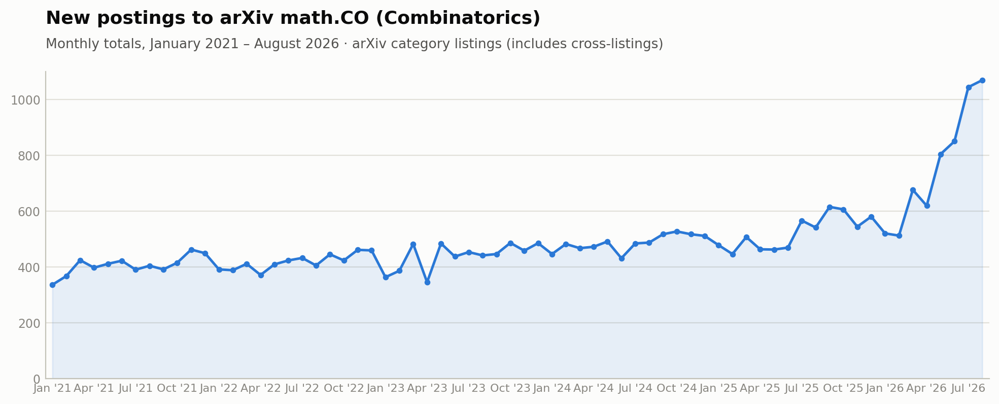
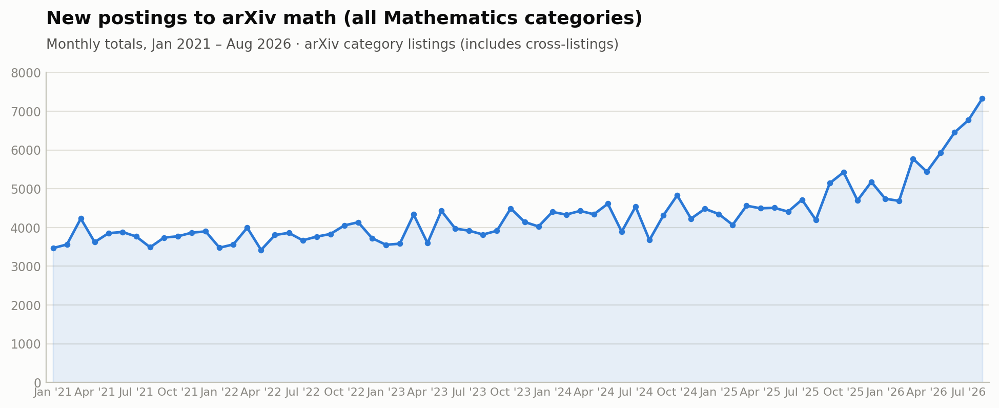

# Mathematics in the Dark Forest

*an open problem list is a bullseye painted on your field*

***

Any mathematician can tell you that math isn't a spectator sport.  To do math research --- or even to really appreciate it --- you have to spend many hours slowly grinding away at examples, guessing at lemmas and trying to prove them as a way of discovering why they're wrong, refining the hypotheses, carving out the right definitions... All that frustration is necessary for the payoff: the feeling of illumination when the pieces all fall into place.

Well, you used to have to do all that.  Now there's another way.

It could be called the [Take a real stab](https://www.anthropic.com/research/riemann-zeta) approach, but I prefer the more informal [Do it up, bro](https://www.math.brown.edu/reschwar/Stories/AI.pdf).  Find a nice open problem, maybe a not-so-famous one, but one that a well-regarded mathematician liked enough to write down and publicize, and possibly even stake their name on it as a conjecture.  Now ask your favorite LLM (say, Claude Fable or GPT-6 Astra) to solve it.  Just a link to the problem statement should be enough, but you can save tokens by pasting in the problem statement.  (Pro tip, if there's a relevant paper on the arXiv, just put in the whole .tex source file.)  It supposedly helps to include some words of encouragement, not necessarily any subtle coaching, just *you got this!* or *go for it!*

Then wait an hour or two, and once Fable gets back with a solution, tell it to write up a report in LaTeX, and you've got an original result --- even better, a result that at least one other mathematician cares about!

***

Is it really that easy?  For the right problem, yes.  And there are *lots* of those.

In September 2026, you probably are not going to solve a Millenium Problem without millions of dollars in compute.  But 99% of mathematicians aren't realistically going to solve those problems anyway; most of us work around the edges, building the structure with intermediate results, or even indirectly, bolstering a research culture that supports investigation till the right ideas come along.  That includes plenty of first-rate work.

A nice way of focusing the attention of researchers in a field --- and of providing targets for grad students and postdocs to aim at --- is to compile a list of open problems and conjectures.  Hilbert wrote eloquently about the virtues of mathematical problems in 1900, many others have since, and I don't have anything meaningful to add, but I'll repeat the banal remark that open problem lists have become a major part of the incentive structure of contemporary mathematical society.

To take a subject close to my heart, algebraic combinatorics, the University of Minnesota hosted a neat event in 2022, [Open Problems in Algebraic Combinatorics](https://www.samuelfhopkins.com/OPAC/opac.html).  There was a conference, and a published proceedings; one of the many great things Sam Hopkins does for the community is maintain a [blog](https://realopacblog.wordpress.com) with a running list of problems posted by him and others.

Hey Claude:
>Go through the list of problems here:
>
>https://www.samuelfhopkins.com/OPAC/opac.html#Proceedings
>
>and on the blog:
>
>https://www.samuelfhopkins.com/OPAC/files/blog.pdf.
>
>Which three do you think are most ripe for Fable to try out via an autonomous run?

Uh oh...

***

I ran this experiment on [OPAC-008](https://realopacblog.wordpress.com/2019/09/15/on-the-cohomology-of-the-grassmannian/), [OPAC-009](https://realopacblog.wordpress.com/2019/09/22/the-schur-cone-and-the-cone-of-log-concavity/), and [OPAC-012](https://realopacblog.wordpress.com/2019/09/30/matrix-counting-over-finite-fields/), using a mix of Claude (Fable 5.1) and ChatGPT-6 (Astra).  They struggled with the first one a bit (but claimed to make progress); together they "solved" each of the second two in a matter of a couple hours.  My input was completely devoid of mathematical content.  I started with this:
>Look in the Dropbox folder attached, and start working on the problem described there. Remember, your goal is a mathematical argument giving a solution or counterexample; focus on constructing proofs. Write and run code only as needed. Use the included mathmemo.sty to write LaTeX notes when headline results are achieved; keep intermediate notes in MD or whatever form you prefer.
>
>After looking at the materials, check in with me if you see any ambiguity or have questions. Let's see if you can knock down this open problem!

And then I kept prodding with variations on "Keep going!" as needed.

You can see the full details [here](https://github.com/pseudoeffective/opac009) and [here](https://github.com/pseudoeffective/opac012) if you're interested, including the papers Fable and Astra produced.

"Solved" is in scare quotes for now, because I have neither checked the solution carefully myself, nor formally verified it in Lean.  However --- if, in the old days, I'd been asked by a journal editor to give a quick opinion on whether these papers are worth refereeing, I might well have said yes.

***

I'm not boasting about these solutions --- my intellectual involvement in obtaining them was about on par with my effort in setting up the GitHub repos where they now live.  And as you'll see if you peruse those transcripts, I haven't divulged any real secret sauce: the cat is out of the bag.  Anyone can do what I did, and therefore many people will.

Looking around the math commentariat, there's some persistent skepticism about the actual capabilities of current models --- even after [Navier-Stokes](https://openai.com/index/navier-stokes-solution/) --- and also about what it takes to get an LLM to solve a nontrivial math research problem.  By conducting this experiment in public, warty prompts and all, I'm hoping to provide evidence of their power and perhaps even convince a few skeptics.  (I also think this is the right way to do such things, if they're going to be done; more on that below.)

I don't intend to post these Fable-Astra papers to the arXiv, much less submit them to a journal.  But let's check in.  How does the `math.CO` section look these days, compared to the last five years?

Interesting!

But maybe it's just because combinatorics is easy for AI.  What about the arXiv at large?

Nope, something's happening all over.

***

In April, David Bessis wrote about something he dubbed the [Overhang](https://davidbessis.substack.com/i/183753276/caveat-3-the-overhang):

>My view is that it is impossible to say for sure, due to a structural feature of the mathematical corpus which, no doubt, is going to play a central role in the AI-for-math debate. In fact, I suspect that our legacy notions of “creativity” and “innovation” are ill-founded, and that AI is about to teach us brutal lessons about them.
>
>Most mathematicians are intuitively aware of this structural feature, although its exact shape and size are impossible to chart. I haven’t seen any serious attempt to theorize it and the feature has no agreed-upon name—let me call it the Overhang.
>
>I expect the Overhang to be absolutely gigantic.

He goes on to develop an illuminating economic and financial analogy:  "The Overhang consists of the unrealized capital gains of past mathematical creativity, the latent value from connecting the dots in the existing corpus."

To paraphrase, among other qualities, we mathematicians tend to value "breadth" in a researcher --- the capacity to internalize a wide swath of results from disparate mathematical subfields, the ability to draw on that knowledge to find connections no one else noticed, often leading to spectacular solutions to long-standing problems.  The "Overhang" is the existence of those unnoticed connections.

When you happen upon one of these surprising connections, the resulting flash of insight is one of the most sublime and satisfying feelings in math, or indeed any intellectual pursuit.  (It works even if you're a student reading about a well-established result --- *Galois extensions of fields are the same thing as covering spaces in topology, wow!*)  These deep analogies between superficially unrelated ideas are responsible for a lot of us getting into the subject in the first place.

They're also something LLMs are *extremely* good at noticing.

***

Let me finally get to the point.

The [dark forest](https://en.wikipedia.org/wiki/Dark_forest_hypothesis) theory is one answer to Enrico Fermi's famous "Where is everybody?" puzzle --- why haven't we seen any evidence of extraterrestrial intelligence?  The name comes from Cixin Liu's majestic *Three Body* trilogy, but the idea is older and shows up in a lot of other sci-fi: in a universe with highly advanced civilizations competing for resources, any visible sign of intelligence is a bullseye painted all over your world.  So to survive, a civilization *must hide itself from all others*.  (My favored explanation for the Fermi paradox --- the universe is big, the space of minds is impossibly huge, quite likely we wouldn't recognize alien intelligence if it was under our noses --- makes for a rather less compelling story.)

Mathematicians are already whispering about hiding. Don't give a talk before your full and final result is published and even then, avoid giving out too many details. Keep your program private, and certainly don't post conjectures.  Otherwise, someone with enough compute is sure to come in and scoop you.

The dark forest response is a rational reaction to hostile conditions.  It might be unavoidable to some degree, as we navigate the transition and adapt to the new technological reality.  But I hope it doesn't come to pass in more than a transitory way.  It would be beyond sad if the most talented and creative mathematical minds turned to keeping secrets as a form of self-protection in a world of intellectual predation.

***

But it would not be without precedent.  This situation was common throughout much of history: Renaissance mathematicians used to "duel" each other with challenges to solve cubic equations, keeping their methods secret in order to win such competitions.<a href="#fn1" id="ref1">1</a>  And even today, communication practices vary widely across disciplines.  The IAS Schools of Mathematics and Natural Science maintain online repositories of nearly 6,000 video lectures, recording nearly every seminar talk over the last 20 years, all of them freely available on YouTube; over the same period, the Schools of History and Social Science combined list roughly 200 videos, most of them public lectures or high-profile events.  Not to mention industry, where protecting proprietary knowledge is simply sound business practice! And any science that has closer contact with industrial development and patenting is going to have a more circumspect culture when it comes to sharing ideas.<a href="#fn2" id="ref2">2</a>

In this sense, although I think it would make things worse, a partial retreat toward secrecy would actually make mathematics more *normal*.

***

To avoid a return to a closed and privatized academy, we're going to need to update our incentives and norms.  The debate about how to adapt is happening all around us, right now --- in public online, in private emails, and in math department committee meetings everywhere.  

It's no longer tenable to use number and quality of published papers as proxy for a researcher's contribution.  Some alternative standards will arise to replace the old one; the question is what will be emphasized, and how will quality be evaluated?  I don't pretend to have all the answers, but here are a few ideas.<a href="#fn3" id="ref3">3</a>

*Giving talks should be accorded more value*.  This is an easy one, and there's already momentum in this direction.  Everyone should be expected to do this.  We can and should associate merit to people speaking in high-profile venues: ICM at the very top, along with plenary lectures at major meetings (like JMM in the US); international venues with long-established reputation like Banff or Oberwolfach on the next tier; and so on.  These "top venues" are a scarce resource, so they can do the job of sorting status, in parallel with "top journals".  There may be need to broaden access by organizing more opportunities for talks, but that will have to be balanced by wariness of devaluing the currency by proliferating venues.

*Still write papers!!*  Written mathematics remains the most robust way of recording and transmitting knowledge.  LLM assistance in writing could (in theory) improve the quality of math papers, so long as it's used judiciously and not as a replacement for the author's own thought and judgement.  Journals and referees might play an increased role, or a diminished one --- it depends on how the editorial boards handle the coming onslaught of submissions.

*Publish the prompt*.  In the past, if your paper used nontrivial new code, you were expected to publish the code.  So now, if your AI use involves anything significant, publish the prompt.  (If it was just the *Do it up, bro* prompt, think about whether you want your name on this paper!)  Even better, publish the whole transcript as a supplement, or offer to make it available to an interested reader.<a href="#fn4" id="ref4">4</a>  Related, we need strong norms around AI declarations, not for judgement either in favor or against those who use it, but to calibrate evaluation of the human author's contribution.  By now, most new arXiv posts include some such statement, so there are plenty of good examples.

*Starter problems are still important; publishing their solutions less so*.  Beginners need a way to get traction, grad students need something to train on.  On the other hand, even before the last year or so, the baseline level of ~400 combinatorics arXiv postings per month was too high for journals to reliably keep up with, or for researchers to authentically digest.  We could balance placing increased value on presenting results live (via in-person lecture) against a decreased insistence on publishing minor advances in journals.

In view of this last item, I'd also suggest that those who are compiling lists of open problems should proceed with great caution in the current environment.  Posing a conjecture in the context of an article is probably not so different now than in the past, but collecting a bunch of them into an easily targeted list is inviting an attack by someone's LLM, like in the demo I described at the beginning of this essay.  (For some kinds of problems, that may be exactly what you want!  The main thing is to make such a choice deliberately, with a view to the consequences.)

***

Many other suggestions are circulating, some in conflict with others.  When it comes to personal practice and preference, diversity is wonderful: across domains of art and creativity, current technology enables things that would have been impossible a few decades ago; on the other hand, self-imposed restrictions and constraints can also lead to heightened aesthetics.  I'm glad not all music is electronic, though, and I hope "artisanal" math will be produced by humans as long as any of us are doing mathematics.  I'm also glad not every film is [Dogme 95](https://en.wikipedia.org/wiki/Dogme_95), and it seems too much to expect every mathematician to take a vow of chastity.

At the community level, though, new norms and structures will emerge, and some kind of consensus will probably dominate.  The choices we make now, in this uncertain time of flux and change --- the standards adopted in department committee meetings, informed by the public debates and private conversations --- will affect how mathematics is done in the future.

At least until the next model is released and the terms of the debate are scrambled again... but that's a topic for another essay.

***

*Thanks to Liz Vivas, Alejandro Morales, Sam Hopkins, Anakin Dey, and Francesco Fournier-Facio for conversations and feedback on an earlier draft.*

-[Dave Anderson](https://pseudoeffective.github.io), 2026.9.22

***

1. Lots more discussion about the past (and future?)
 secrecy in mathematics is at this MathOverflow <a href="https://mathoverflow.net/questions/515260/how-do-we-prevent-mathematics-from-devolving-into-the-medieval-era-of-secrecy">post</a>.
<a href="#ref1">↩</a>

2. At the border of industry and science, a 2009 editorial in a medical journal suggested reviving the 18th-century practice of <i>pli cacheté</i> --- sealed envelopes that establish priority claims --- as a way of safeguarding patents, see <a href="https://www.sciencedirect.com/science/article/pii/S0306987708004192">here</a>. 
<a href="#ref2">↩</a>

3. Benjamin Antieau's <a href="https://antieau.github.io/2026/09/15/fast-math-slow-math.html">essay</a> is excellent on this topic.  Other variations on this theme are all over discussion boards and lunchtime conversations, so the basic ideas seem popular enough to gain traction.  Incidentally, Antieau's blog also includes a scientific <a href="https://antieau.github.io/2026/09/04/what-i-asked-ai-about-mathematics.html">catalogue</a> of questions solved by autonomous (or essentially autonomous) AI runs.<a href="#ref3">↩</a>

4. To the extent possible, at least.  The GitHub repos hosting my OPAC experiments include detailed summaries, but not complete transcripts of the models' chain of thought.  Commercially available models often come with restricted access to reasoning and CoT, for both IP and safety reasons.  I don't have a position on how to balance those considerations against norms of scientific openness, but Segev Gonen Cohen wrote an <a href="https://proofsandprompts.com/2026/08/11/the-question-of-reasoning-traces/">essay</a> with a thoughtful exploration of this question. <a href="#ref4">↩</a>
